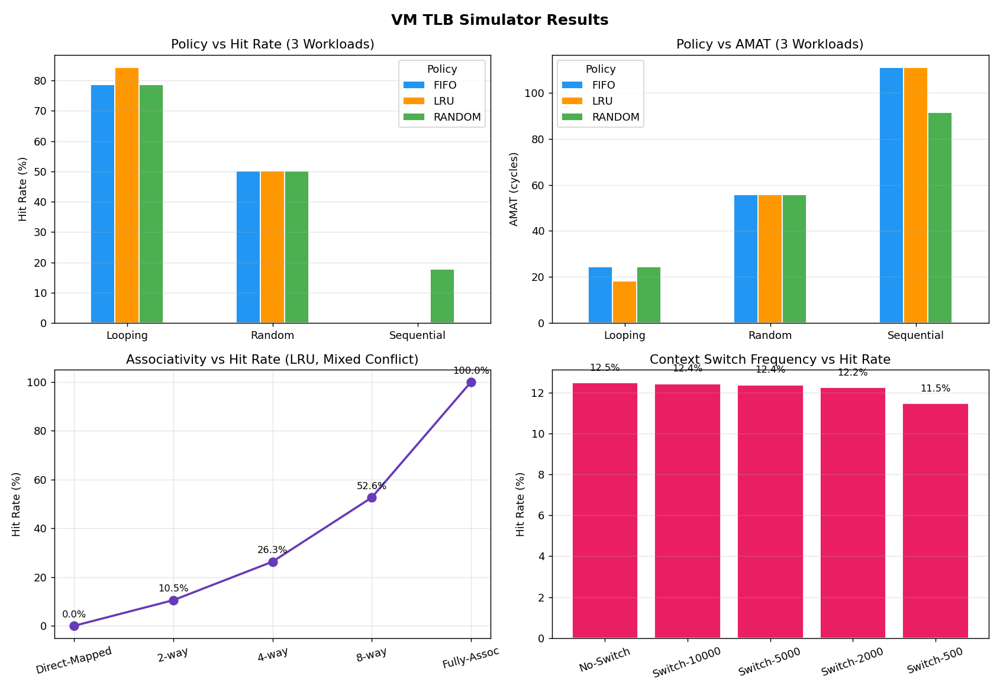

# VM TLB Simulator

A C++-based simulator to study Translation Lookaside Buffer (TLB) behavior under different workloads, replacement policies, associativity levels, and context switching scenarios.

## Overview

This project simulates a virtual memory system focusing on TLB performance. It evaluates:

- Replacement policies (LRU, FIFO, RANDOM)
- Associativity (Direct-mapped → Fully associative)
- Workload patterns (Sequential, Random, Looping, Conflict)
- Context switching effects (TLB flush impact)

The simulator outputs:

- Hit rate
- Average Memory Access Time (AMAT)

Results are exported to CSV and visualized using Python.

## Program Design
### 1. TLB (`TLB.h`)

Implements a set-associative TLB with configurable:

- Total entries
- Associativity
- Replacement policy

Key Features:
- Supports LRU, FIFO, RANDOM
- Uses:  
`last_used` → LRU  
`insert_time` → FIFO  

Set mapping via:  
`set_index = VPN % num_sets`

Tradeoffs:
- LRU → Best performance, higher overhead
- FIFO → Simple, may evict useful entries
- RANDOM → Fast, unpredictable

### 2. Page Table (`PageTable.h`)

Implements a Two-Level Page Table.

Structure:
- L1 index (10 bits)
- L2 index (10 bits)
- Offset (12 bits)

Design:
- Uses sparse representation (unordered_map)
- Allocates PFNs dynamically:
`first access → assign new frame` 

Tradeoffs:
- Memory efficient
- No page replacement (infinite memory assumption)

### 3. Simulator (`Simulator.h`)

Core execution engine.  

Workflow:  
Virtual Address → VPN  
       ↓  
   TLB Lookup  
       ↓  
Hit → return PFN  
Miss → PageTable lookup → Insert into TLB  

Metrics tracked:
- TLB hits/misses
- Context switches
- Hit rate
- AMAT

AMAT Formula:  
`AMAT = TLB_HIT_COST + (1 - hit_rate) × (PT_WALK_COST + MEM_ACCESS)`

Constants:
- TLB access = 1 cycle
- Page table walk = 10 cycles
- Memory access = 100 cycles

### 4. Workload Generator (`WorkloadGenerator.h`)

Generates memory traces.

Supported workloads:

| Workload    | Behavior                 |
| ----------- | ------------------------ |
| Sequential  | Linear scan              |
| Random      | Uniform random access    |
| Looping     | 80% hot region, 20% cold |
| Working Set | Fixed repeated pages     |
| Conflict    | Forces TLB set conflicts |

Key Design:
- Uses std::mt19937 (seed = 42) → reproducible results
- Conflict workload stresses associativity

### 5. Main Program (`main.cpp`)

Drives experiments:

Experiments:  
1. EXP1: Policy Comparison  
Workloads: Sequential, Random, Looping  
Policies: LRU, FIFO, RANDOM  

2. EXP2: Associativity Impact  
Direct-mapped → Fully associative  
Conflict workload  

3. EXP3: Context Switching  
TLB flush frequency variation  

Output:  
- Console results
- CSV file (results.csv)

### 6. Visualization (`visualize.py`)

Generates plots from CSV:

Plots:
- Policy vs Hit Rate
- Policy vs AMAT
- Associativity vs Hit Rate
- Context Switch vs Hit Rate

## Steps to Compile & Run
Compile:    
`g++ -std=c++17 main.cpp -o simulator`

Run:  
`./simulator`

Generate Plots:  
`python3 visualize.py`

## Libraries Used
C++:  
`<vector>`  
`<unordered_map>`  
`<random>`  
`<iostream>`  
`<fstream>`  
`<iomanip>`  
Python:  
`matplotlib`  
`pandas`  

## Results

| Experiment | Workload      | Policy | TLB Size | Assoc | Hit Rate (%) | AMAT (cycles) | Context Switches |
| ---------- | ------------- | ------ | -------- | ----- | ------------ | ------------- | ---------------- |
| EXP1       | Sequential    | LRU    | 64       | 4     | 0.0000       | 111.0000      | 0                |
| EXP1       | Sequential    | FIFO   | 64       | 4     | 0.0000       | 111.0000      | 0                |
| EXP1       | Sequential    | RANDOM | 64       | 4     | 17.7860      | 91.4354       | 0                |
| EXP1       | Random        | LRU    | 64       | 4     | 50.1295      | 55.8575       | 0                |
| EXP1       | Random        | FIFO   | 64       | 4     | 50.1735      | 55.8091       | 0                |
| EXP1       | Random        | RANDOM | 64       | 4     | 50.1090      | 55.8801       | 0                |
| EXP1       | Looping       | LRU    | 64       | 4     | 84.2305      | 18.3465       | 0                |
| EXP1       | Looping       | FIFO   | 64       | 4     | 78.6230      | 24.5147       | 0                |
| EXP1       | Looping       | RANDOM | 64       | 4     | 78.6820      | 24.4498       | 0                |
| EXP2       | Direct-Mapped | LRU    | 64       | 1     | 0.0000       | 111.0000      | 0                |
| EXP2       | 2-way         | LRU    | 64       | 2     | 10.5260      | 99.4214       | 0                |
| EXP2       | 4-way         | LRU    | 64       | 4     | 26.3150      | 82.0535       | 0                |
| EXP2       | 8-way         | LRU    | 64       | 8     | 52.6280      | 53.1092       | 0                |
| EXP2       | Fully-Assoc   | LRU    | 64       | 64    | 99.9905      | 1.0104        | 0                |
| EXP3       | No-Switch     | LRU    | 64       | 4     | 12.4820      | 97.2698       | 0                |
| EXP3       | Switch-10000  | LRU    | 64       | 4     | 12.4305      | 97.3264       | 19               |
| EXP3       | Switch-5000   | LRU    | 64       | 4     | 12.3795      | 97.3825       | 39               |
| EXP3       | Switch-2000   | LRU    | 64       | 4     | 12.2400      | 97.5360       | 99               |
| EXP3       | Switch-500    | LRU    | 64       | 4     | 11.4610      | 98.3929       | 399              |

## Observations / Analysis

### 1. Replacement Policy
- LRU performs best under locality-heavy workloads (Looping)
- FIFO and RANDOM perform similarly but worse than LRU
- Sequential workload:
    - LRU/FIFO fail due to no reuse
    - RANDOM slightly better due to accidental reuse

### 2. Workload Behavior
| Workload   | Insight                               |
| ---------- | ------------------------------------- |
| Sequential | Very low reuse → poor TLB performance |
| Random     | Moderate reuse → ~50% hit rate        |
| Looping    | Strong locality → high hit rate       |
| Conflict   | Highlights associativity limits       |

### 3. Associativity Impact
- Direct-mapped → 0% hit rate (severe conflicts)
- Increasing associativity:

    - 2-way → 10%
    - 4-way → 26%
    - 8-way → 52%
    - Fully → ~100%
- Shows conflict misses dominate low-associativity designs

### 4. Context Switching
- Frequent TLB flush → lower hit rate
- Higher switch frequency:

    - No switch → 12.48%
    - Switch-500 → 11.46% 
- Impact is moderate because:
    - Workload is already random
    - Limited reuse

### 5. AMAT Trends

- Strong inverse relationship: `Higher hit rate → lower AMAT`
------------------------------------------------------------------------------------------
